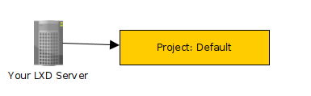

`LXD` is very similar to Google's ecosytem.

*If you haven't been exposed to Google's ecosystem don't worry,  I hope to explain it here!*

Lets look at one stadalone `LXD` server

*If you have never run an LXD server don't worry, here is a tutorial if you want to be in sync (TODO)*

In the last few years LXD has introduced the concept of `projects` so
we must think about that aswell.

## First Steps

Lets imagine you buy one new server;

 - You install any firmware upgrades
 - You configure your RAID prefrences
 - You would install an operating system
   - Not VMware or Proxmox (Instead Ubuntu, Centos, Redhat ETC)
 - You then run `snap instal lxd` (TODO: stable channels or latest?)
 - Followed by `lxd init` (TODO: storage & bridge vs proxy devices)

Lets assume you now have a single standalone `LXD` server running, you server
looks something like this;

*One server with a `project` called "default"*

### Next
[Lets undestand LXD Projects!](undestanding_projects.html)
